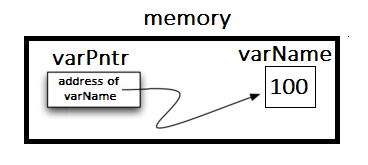

..  Copyright (C)  Jan Pearce and Brad Miller
    This work is licensed under the Creative Commons Attribution-NonCommercial-ShareAlike 4.0 International License. To view a copy of this license, visit http://creativecommons.org/licenses/by-nc-sa/4.0/.

Using Data in C++
~~~~~~~~~~~~~~~~~

C++ requires the users specify the specific data type of each variable before it is used.
The primary C++ built-in atomic data types are: integer (``int``),
floating point (``float``), double precision floating point (``double``),
Boolean (``bool``), and character (``char``).

Numeric Atomic Data Types
^^^^^^^^^^^^^^^^^^^^^^^^^

Numeric C++ data types include ``int`` for integer, ``float``
for floating point, ``double`` for double precision floating point.

The standard arithmetic operations, +, -, \*, and /
are used with optional parentheses to force the order of
operations away from normal operator precedence.

In Python we can use ``//`` to get integer division.
In C++, we declare all data types.
When two integers are divided in C++, the integer portion of the
quotient is returned and the fractional portion is removed.
To get the whole quotient, declaring one of the numbers as a float will
convert the entire result into floating point.

Exponentiation in C++ is done using ``pow()`` from the ``cmath`` library
and the remainder (modulo) operator is done with ``%``.

Run the following code to see that you understand each result.

.. tabbed:: intro

  .. tab:: C++

    .. activecode:: intro_1cpp
        :caption: Basic Arithmetic Operators C++
        :language: cpp

        #include <iostream>
        #include <cmath>
        using namespace std;

        int main(){

            cout << (2+3*4) << endl;
            cout << (2+3)*4 << endl;
            cout << pow(2, 10) << endl;
            cout << float(6)/3 << endl;
            cout << float(7)/3 << endl;
            cout << 7/3 << endl; //In C++ this is integer division
            cout << 7%3 << endl;
            cout << float(3)/6 << endl;
            cout << 3/6 << endl;
            cout << 3%6 << endl;
            cout << pow(2, 100) << endl;

            return 0;
        }

  .. tab:: Python

    .. activecode:: intro_1py
        :caption: Basic Arithmetic Operators Python

        def main():

            print(2+3*4)
            print((2+3)*4)
            print(2**10)
            print(6/3)
            print(7/3)
            print(7//3)
            print(7%3)
            print(3/6)
            print(3//6)
            print(3%6)
            print(2**100)

        main()

When declaring numeric variables in C++,
modifiers like ``short``, ``long``, and ``unsigned``
can optionally be used to help
to ensure space is used as efficiently as possible.

.. mchoice:: mc_integer_div
   :answer_a: 1
   :answer_b: 1.5
   :answer_c: 2
   :answer_d: A run-time error will occur.
   :answer_e: none of the above
   :correct: a
   :feedback_a: Right!  This is like ``3//2`` in Python.
   :feedback_b: No. Integer division is used. Try again.
   :feedback_c: No. Integer division is used. Try again.
   :feedback_d: No, C++ generally will try to do as you ask.
   :feedback_e: One of the above is correct.

   what is the result of dividing ``3/2`` in C++?

.. mchoice:: mc_exponentiation
  :answer_a: ``4**5``
  :answer_b: ``5**4``
  :answer_c: ``4^5``
  :answer_d: ``pow(4, 5)``
  :correct: e
  :feedback_a: No, ``**`` is used in Python, not C++.
  :feedback_b: No, ``**`` is used in Python, not C++, and the operators are reversed.
  :feedback_c: No. The ``^`` is a valid operator in C++, but it does something else.
  :feedback_d: You got it!

  How do I raise 4 to 5th power in C++?

The Boolean Data Type
^^^^^^^^^^^^^^^^^^^^^

Boolean data types are named after George Boole who was an English mathematician,
so the word "Boolean" should be capitalized. However,
the Boolean data type, in C++ uses the keyword ``bool``
which is not capitalized.
The possible state values
for a C++ Boolean are lower case ``true`` and ``false``.
Be sure to note the difference in capitalization from Python.
In Python, these same truth values are capitalized, while in C++,
they are lower case.

C++ uses the standard Boolean operators, but they are represented
differently than in Python: ``&&`` (and), ``||`` (or), and ``!`` (not).
Note that the output values for ``true`` and ``false`` are ``1``
and ``0`` respectively.

.. tabbed:: logical1

  .. tab:: C++

    .. activecode:: logical_1cpp
        :caption: Logical Operators C++
        :language: cpp

        #include <iostream>
        using namespace std;

        int main() {
          cout << true << endl;
          cout << false << endl;
          cout << (true || false) << endl;
          cout << (true && false) << endl;
          return 0;
        }

  .. tab:: Python

        .. activecode:: logical_1py
            :caption: Logical Operators Python

            def main():
                print(True)
                print(False)
                print(True or False)
                print(True and False)
            main()

Boolean data objects are also used as results for comparison operators
such as equality (==) and greater than (:math:`>`). In addition,
relational operators and logical operators can be combined together to
form complex logical questions. :ref:`Table 1 <tab_relational>` shows the relational
and logical operators with examples shown in the session that follows.

.. _tab_relational:

.. table:: **Table 1: C++ Relational and Logical Operators**

    =========================== ============== =================================================================
             **Operation Name**   **Operator**                                                   **Explanation**
    =========================== ============== =================================================================
                      less than      :math:`<`                                                Less than operator
                   greater than      :math:`>`                                             Greater than operator
             less than or equal     :math:`<=`                                    Less than or equal to operator
          greater than or equal     :math:`>=`                                 Greater than or equal to operator
                          equal     :math:`==`                                                 Equality operator
                      not equal     :math:`!=`                                                Not equal operator
                    logical and     :math:`&&`                          Both operands true for result to be true
                     logical or     :math:`||`        One or the other operand is true for the result to be true
                    logical not      :math:`!`   Negates the truth value, false becomes true, true becomes false
    =========================== ============== =================================================================

.. tabbed:: basiclogical

  .. tab:: C++

    .. activecode:: locicalcpp
        :caption: Basic Relational and Logical Operators C++
        :language: cpp

        #include <iostream>
        using namespace std;

        int main(){

            cout << (5 == 10) << endl;
            cout << (10 > 5) << endl;
            cout << (5 >= 1 && 5 <= 10) << endl;

            return 0;
        }

  .. tab:: Python

    .. activecode:: logicalpy
        :caption: Basic Relational and Logical Operators Python

        def main():

            print(5 == 10)
            print(10 > 5)
            print((5 >= 1) and (5 <= 10))

        main()

A C++ variable can be created when declared and initialized with a type on
the left-hand side of an assignment statement. Assignment statements
provide a way to associate a name with a value. The variable will hold a
piece of data. Consider the
following session:

.. activecode:: booleanpitfall
    :language: cpp

    #include <iostream>
    using namespace std;

    int main(){

        int theSum = 4;
        cout << theSum << endl;

        theSum = theSum + 1;
        cout << theSum << endl;

        bool theBool = true;
        cout << theBool << endl;

        theBool = 4;
        cout << theBool << endl;

        return 0;
    }

The assignment statement ``int theSum = 0;`` creates a variable called
``theSum`` and initializes it to hold the data value of ``0``.
As in Python, the right-hand side of the assignment
statement is evaluated and the resulting data value is
“assigned” to the variable named on the left-hand side.
Here the type of the variable is integer.
In Python, if the type of the data
changes in the program, so does the type of the variable.
However, in C++, the data type cannot change.
This is a characteristic of C++'s static typing. A
variable can hold ever only one type of data.
Pitfall: C++ will often simply try to do the assignment you requested without
complaining. Note what happened in the code above in the final output.

The Character Data Type
^^^^^^^^^^^^^^^^^^^^^^^

In Python strings can be created with single or double quotes.
In C++ single quotes are used for the character (``char``) data type,
and double quotes are used for the string data type.

Consider the following code.

.. tabbed:: basiclogical

  .. tab:: C++

    .. activecode:: charcpp
        :caption: Considering characters and strings
        :language: cpp

        #include <iostream>
        #include <string>
        using namespace std;

        int main(){

            string strvar = "b";
            char charvar = 'b';

            cout << ('b' == charvar) << endl;
            cout << ("b" == strvar) << endl;
            //cout << ('a' == "a") << endl; // will error!

            return 0;
        }

  .. tab:: Python

    .. activecode:: charpy
        :caption: Python strings

        def main():

            strvar = "b"
            charvar = 'b'

            print('b' == charvar)
            print("b" == strvar)
            print('a' == "a")

        main()

.. mchoice:: mc_cpp_strings
   :answer_a: ' '
   :answer_b: " "
   :answer_c: ' ' or " " may be used
   :answer_d: It depends upon the implementation.
   :answer_e: none of the above
   :correct: b
   :feedback_a: No, single quotes are only used for single characters.
   :feedback_b: Good job reading!
   :feedback_c: No. Try again.
   :feedback_d: No. Try again.
   :feedback_e: One of the above is indeed correct.

   If I want to create a string in C++, what set of symbols may be used?

Introduction to Pointers
^^^^^^^^^^^^^^^^^^^^^^^^

We know that variables in a computer program are used to label data with a
descriptive identifier so that the data can be accessed and used by that
computer program. However, some differences in how variables are implemented
in Python and in C++ are worthy of discussion.

Let's look at some examples of storing an integer in Python and C++.

In Python every single thing is stored as an object.
Hence, a Python variable is actually a reference to an object that is stored in memory.
Hence, each Python variable requires two memory locations:
one to store the reference, and the other to store the variable value itself in an object.

In C++ the value of each variable is stored directly in memory without the need
for either a reference or an object. This makes access faster, but it is one of
the reasons we need to declare each variable because different types take differing
amounts of space in memory!

The following code declares a variable called *varName* that has in it a
value of 100:

::

    // Python reference for a single integer value
    varName = 100

.. _fig_py_reference:

.. figure:: Figures/python_reference.png
   :align: center
   :alt: "arrow from varName to box containing 100 object"

   Figure 4: Python reference

::

    // C++ variable declaration and assignment of an integer value
    int varName = 100;

In C++ the results of running this code will look like the diagram below:

.. _fig_cpp_reference:

.. figure:: Figures/cpp_var.png
   :align: center
   :alt: "Box named varName containing value of 100"

   Figure 4: C++ variable

In each case, when we want to output the value to the console, we use the variable name
to do so.

But, we can also identify the memory location of the variable,
which is sometimes very valuable. In both Python and C++, this address is
may change each time the program is run. In C++, this will always look
odd because it will be the actual memory address written in a hexadecimal code
which is a base 16 code like 0x7ffd93f25244.
In Python it is implementation dependent,
it is sometimes a hexadecimal code and sometimes just a count or another
way to reference the address.

In Python we use ``id`` to reference the address,
while in C++ we use the *address-of operator*, ``&``.

.. tabbed:: memory-addresses

  .. tab:: C++

    .. activecode:: address_cpp
        :caption: Memory addresses in C++
        :language: cpp

        #include <iostream>
        using namespace std;

        int main(){
            int varName = 101;
            cout << varName << endl;
            cout << &varName << endl;
            return 0;
        }

  .. tab:: Python

    .. activecode:: address_py
        :caption: Memory identifier in Python

        def main():
            varName = 101;
            print(varName)
            print(id(varName))

        main()

In both Python and C++, variables are stored in memory locations which are dependent
upon the run itself. If you repeatedly run the above code in either C++ or Python, you may
see the location change.

As suggested above, in Python, it is impossible to store a variable directly.
Instead, we must use a variable name and a reference to the data object.
(Hence the arrow in the image.)
In C++, variables store values directly, which is faster to reference.

References are slower, but they are sometimes useful.
If in C++, we want to create a analogous reference to a memory location in C++,
we must use a special syntax called a **pointer**.

Pointer Syntax
--------------

When declaring a pointer in C++ that will "point" to the memory address of some
data type, like all variables do in Python,
you will use the same rules of declaring variables and data types.
The key difference is that there must be an asterisk (*) between the data type and the
identifier.

::

    variableType *identifier; // syntax to declare a C++ pointer
    int *ptrx; // example of a C++ pointer to an integer

White space in C++ generally does not matter, so the following pointer declarations
are identical:

::

    SOMETYPE *variablename; // preferable
    SOMETYPE * variablename;
    SOMETYPE* variablename;

However, the first declaration is preferable because it is clearer to the
programmer that the variable is in fact a pointer because the asterisk is closer
to the variable name.

The address-of operator, ``&``
------------------------------

Now that we know how to declare pointers, how do we give them the address of
where the value is going to be stored? One way to do this is to have a pointer
refer to another variable by using the address-of operator, which is denoted by the
ampersand symbol, ``&``. The address-of operator ``&`` does exactly what it indicates,
namely it returns the address.

The syntax is shown below, where varName stores the value, and varPntr stores
the address of where varName is located:

::

    variableType varName;  // a variable to hold the value
    variableType *varPntr = &varName;  // a variable to hold the address for varName

Keep in mind that when declaring a C++ pointer, the pointer needs to
reference the same type as the variable or constant to which it points.

Expanding on the example above where varName has the value of 100.

::

    //variable declaration for a single integer value
    int varName = 100;
    int *varPntr;
    varPntr = &varName;

The results of running this C++ code will look like the diagram below.

.. _fig_point2:

   Figure 5: FIXME2

Accessing Values from Pointers
------------------------------

So, once you have a C++ pointer, how do you access the values associated with that location?
You use the asterisk before the pointer variable, which
goes to that address, effectively *dereferencing* the pointer,
meaning that it will find the location of the value stored where the pointer was
pointing.

In other words, varName and \*varPntr (note the asterisk in front!) reference the same
value in the code above.

Let's extend the example above to output the value of a variable and its address
in memory:

.. _lst_cppcode1:

    .. activecode:: examplecpp
        :language: cpp

        #include <iostream>
        using namespace std;

        int main( ) {
            int varName = 100;
            int *varPntr = &varName;

            cout << "varName has value: " << varName << endl;
            cout << "varPntr says varName is located at: " << varPntr << endl;
            cout << "varPntr is pointing to (varName) with the value: "
                 << *varPntr << "\n\n";

            varName = 50;

            cout << "Changing varName, to: " << varName << endl;
            cout << "varPntr now points to memory with the value: "
                 << *varPntr << "\n\n";

            *varPntr = 2000;
            cout << "Changing *varPntr, varName to: " << varName << endl;
            cout << "varPntr now points to memory with the value: " << *varPntr << endl;

            return 0;
        }

Compiling and running the above code will have the program output the value in varName,
what is in varPntr (the memory address of varName), and what value is located at that
memory location.

The second output sentence is the address of varName, which would most likely be
different if you run the program on your machine.

WARNING: What happens if you forget the asterisk when assigning a value to a pointer
and had the following instructions instead?

.. _lst_cpperror1:

    .. activecode:: error1cpp
        :language: cpp

        #include <iostream>
        using namespace std;

        int main( ) {
             varPntr = 2000; // Notice that I forgot the asterisk,
                             // so varPntr is now referring position 2000
                             // in memory, whatever happens to be there!
             cout << "\*varPntr, varName now has: "
                  << varName << endl;
             cout << "varPntr now points to the value: "
                  << \*varPntr << endl;

**This is BAD BAD!**

.. _fig_point3:

.. figure:: Figures/point_broken.png
   :align: center
   :alt: image

   Figure 6: FIXME3

If your compiler does not catch that error (the one for this class may),
the first ``cout`` instruction outputs

::

    After changing *varPntr, varName now has: 50

which is expected because you changed where varPntr pointing to and
NOT the contents of where it is pointing.

The second ``cout`` instruction is a disaster because
(1) You don't know what is stored in location 2000 in memory, and
(2) that location is outside of your segment (area in memory reserved for your program), so the operating system will jump in with a message about a "segmentation fault". Although such an error message looks bad, a "seg fault" is in fact a helpful error because unlike the elusive logical errors, the reason is fairly localized.

The null pointer
----------------

Like ``None`` in Python, the null pointer in C++ points to nothing and is often
denoted by the keyword null or by 0.
The null pointer is often used in conditions and/or in logical operations.

The following example demonstrates how the null pointer works.
The variable ptrx initially has the address of x when it is declared.
On the first iteration of the loop, it is assigned the value of null (i.e. 0)
thereby ending the loop:

.. _lst_cppcode2:

    .. activecode:: examplecpp2
        :language: cpp

        #include <iostream>
        using namespace std;

        int main( ) {
            int x = 12345;
            int *ptrx = &x;

            while (ptrx) {
                cout << "Pointer ptrx points to " << &ptrx;
                ptrx = null;
            }

            cout << "Pointer ptrx points to nothing!\n";
        }

Helpful Tip: The null pointer becomes very useful when you must test the state of
a pointer, such as whether the assignment to an address was valid or not.

Collection Data Types
~~~~~~~~~~~~~~~~~~~~~

In addition to the numeric and Boolean classes, C++ has a number of
very powerful built-in collection classes. Arrays, strings, and tuples
are ordered collections that are very similar in general structure but
have specific differences that must be understood for them to be used
properly. Sets and hash tables are unordered collections.

Arrays
^^^^^^

**What is an Array?**

An **array** is an ordered collection of zero or more C++ data objects of identical type.
Arrays are written as comma-delimited values enclosed in
curly brackets. Arrays are homogeneous, meaning that the data objects all need to be from the
same class and the collection can be assigned to a variable as below.

**Why use an Array?**

Although we have already seen how to store large amounts of data in files, we have as yet no convenient way to manipulate such data from within programs.
For example, we might want to write a program that inputs and then ranks or sorts a long list of numbers.
C++ provides a structured data type called an array to facilitate this kind of task.
The use of arrays permits us to set aside an ordered list of memory locations that we can then manipulate as a single entity, but that at the same time gives us direct access to any individual component.
You can think of arrays conceptually as just a list of variables that all of the same data type (int, char or whatever). You can directly access an item in the array, such as the first, second, or last one.

The following fragment shows a variety of C++ data objects in an array.

::

    >>> int arr[] = {1, 2, 3, 4};
    >>> char arr2[] = {'a', 'b', 'c'};
    >>> string arr3[] = {"this", "is", "an", "array"};

In order to remember the array for later processing, its
reference needs to be assigned to a variable.

Note that the indices for arrays (sequences) start counting with 0.
Sometimes, you will want to initialize an array. For example,

::

    >>> int myList[6] = { };
    >>> myList
    [0, 0, 0, 0, 0, 0]

Strings
^^^^^^^
**Strings** are sequential collections of zero or more letters, numbers
and other symbols. We can get strings from the Standard template library with ``#include <string>`` We call these letters, numbers and other symbols
*characters*. Literal string values are differentiated from identifiers
by using double quotation marks.

::

    >>> string myName = "David";
    >>> myName[3];
    'i'
    >>> myName.length()
    5

Since strings are sequences, all of the sequence operations described
above work as you would expect. In addition, strings have a number of
methods, some of which are shown in :ref:`Table 4<tab_stringmethods>`.

.. _tab_stringmethods:

.. table:: **Table 4: Methods Provided by Strings in Python**

    ======================== ================================ =============================================================
             **Method Name**                   **Use**                                               **Explanation**
    ======================== ================================ =============================================================
                  ``append``       ``astring.append(string)``                        Append to string the end of the string
               ``push_back``      ``astring.push_back(char)``                  Appends a character to the end of the string
                ``pop_back``           ``astring.pop_back()``         Deletes the last character from the end of the string
                  ``insert``    ``astring.insert(i, string)``                          Inserts a string at a specific index
                   ``erase``          ``astring.erase(i, i)``                   Erases an element from one index to another
                    ``find``           ``astring.find(item)``         Returns the index of the first occurrence of ``item``
    ======================== ================================ =============================================================

A major difference between arrays and strings is that arrays can be
modified while strings cannot. This is referred to as **mutability**.
arrays are mutable; strings are immutable. For example, you can change an
item in a list by using indexing and assignment. With a string that
change is not allowed.

C Strings and C++ String Objects
^^^^^^^^^^^^^^^^^^^^^^^^^^^^^^^^

Both the C and C++ cstring library functions are available to C++ programs. However, do not overlook the fact that these two function libraries are very different, and the functions of the first library have a different notion of what a string is from the corresponding notion held by the functions of the second library. There are two further complications: first, though a function from one of the libraries may have a counterpart in the other library (i.e., a function in the other library designed to perform the same operation), the functions may not be used in the same way, and may not even have the same name; second, because of backward compatibility many functions from the C++ String library can be expected to work fine and do the expected thing with C strings, but not the other way around.
The last statement above might seem to suggest we should use C++ Strings and forget about C-strings altogether, and it is certainly t rue that there is a wider variety of more intuitive operations available for C++ Strings. However, C-strings are more primitive, you may therefore find them simpler to use (provided you remember a few simple rules, such as the fact that the null character must always terminate such strings), and certainly if you read other, older programs you will see lots of C-strings. You should thus use whichever you find more convenient, but remember that they are very different; if you occasionally need to mix the two for some reason, be extra careful. Finally, there are certain situations in which C-Strings must be used as in the use of filenames as we have seen.

.. _tab_stringmethods2:

.. table:: **Table 5: String Methods in C++**

    ====================================== ================================================= ================================
                            **Categories**                     **C-Strings**                         **C++ Strings**
    ====================================== ================================================= ================================
                             Import Syntax                             ``#include<cstring>``             ``#include<string>``
                            Declare Syntax             ``char str[10];//can store <=9chars`` ``string str;//Unlimitedlength``
                       Initializing Syntax                 ``char str1[11] = "Call home!";``   ``string str1("Call home!");``
                       Initializing Syntax                  ``char str2[] = "Send money!";`` ``string str2 = "Send money!";``
                       Initializing Syntax               ``char str3[] = {'O', 'K', '\0'};``           ``string str3("OK");``
                       Initializing Syntax              ``// which has the same effect as:``        ``string str4(10, 'x');``
                       Initializing Syntax                           ``char str3[] = "OK";``          ``string str3 = "OK";``
            Concatenating/Combining Syntax                           ``strcat(str1, str2);``           ``str = str1 + str2;``
                          Comparing Syntax                   ``if(strcmp(str1, str2) < 0 )``            ``if( str1 < str2):``
                          Comparing Syntax                    ``cout<< "str1 comes first."``  ``cout<< "str1 comes first.";``
                          Comparing Syntax                  ``if(strstrcmp(str1, str2)==0)``            ``if( str1 == str2)``
                          Comparing Syntax                       ``cout<< "Equal Strings."``    ``cout << "Equal strings.";``
                          Comparing Syntax                   ``if(strstrcmp(str1, str2)>0)``           ``if( str1 > str2 ):``
                          Comparing Syntax                    ``cout<< "str2 comes first."``   ``cout<<"str2 comes first.";``
    ====================================== ================================================= ================================

A major difference between arrays and strings is that arrays can be
modified while strings cannot. This is referred to as **mutability**.
arrays are mutable; strings are immutable. For example, you can change an
item in a list by using indexing and assignment. With a string that
change is not allowed.

Tuples
^^^^^^

**Tuples** are very similar to arrays in that they are sequential containers.
We can get a tuple from the Standard template library with
``#include <tuple>`` The difference is that a tuple is immutable, like a
string. A tuple cannot be changed. Tuples are written as comma-delimited
values enclosed in parentheses. For example,

::

    >>> myTuple = (2, 3, 4.96)
    >>> myTuple
    (2, True, 4.96)
    >>> get<0>(myTuple);
    2

Sets
^^^^

A **set** is an unordered collection of zero or more immutable C++ data
objects. We can get a set from the Standard template library with ``#include <set>``. Sets do not allow duplicates and are written as comma-delimited
values enclosed in curly braces. The collection can be assigned to
a variable as shown below.

::

    >>> set<int> mySet = {3, 6, 4, 78, 10}
    {3, 6, 4, 78, 10}

Sets support a number of methods that should be familiar to those who
have worked with them in a mathematics setting. :ref:`Table 6 <tab_setmethods>`
provides a summary. Examples of their use follow.

.. _tab_setmethods:

.. table:: **Table 6: Methods Provided by Sets in C++**

    ======================== ================================= ================================================================
             **Method Name**                           **Use**                                                  **Explanation**
    ======================== ================================= ================================================================
                   ``union``                   ``set_union()``               Returns a new set with all elements from both sets
            ``intersection``            ``set_intersection()``   Returns a new set with only those elements common to both sets
              ``difference``              ``set_difference()``    Returns a new set with all items from first set not in second
                     ``add``             ``aset.insert(item)``                                             Adds item to the set
                  ``remove``              ``aset.erase(item)``                                        Removes item from the set
                   ``clear``                  ``aset.clear()``                                Removes all elements from the set
    ======================== ================================= ================================================================

Hash Tables
^^^^^^^^^^^
Our final C++ collection is an unordered structure called a
**Hash Table**. Hash Tables are collections of associated pairs of
items where each pair consists of a key and a value. This key-value pair
is typically written as key=value. For example,

::

    >>> unordered_map<string, string> capitals;
    >>> capitals["Iowa"] = "DesMoines";
    >>> capitals["Wisconsin"] = "Madison";

We can manipulate a dictionary by accessing a value via its key or by
adding another key-value pair. The syntax for access looks much like a
sequence access except that instead of using the index of the item we
use the key value. To add a new value is similar.

.. tabbed:: edit

    .. tab:: C++

        .. activecode:: intro_7cpp
            :caption: Using a Hash Table C++
            :language: cpp

            #include <iostream>
            #include <map>
            #include <string>
            using namespace std;

            int main() {
                map<string, string> capitals;

                capitals["Iowa"] = "Desmoines";
                capitals["Wisconsin"] = "Madison";
                cout << capitals["Iowa"] << endl;
                capitals["Utah"] = "SaltLakeCity";

                capitals["California"] = "Sacramento";
                cout << capitals.size() << endl;

                for (map<string, string>::iterator it=capitals.begin(); it!=capitals.end(); ++it){
                    cout << it->second << " is the capital of " << it->first << '\n';
                }
            }

    .. tab:: Python

        .. activecode:: intro_7py
            :caption: Using a Dictionary

            capitals = {'Iowa':'DesMoines','Wisconsin':'Madison'}
            print(capitals['Iowa'])
            capitals['Utah']='SaltLakeCity'
            capitals['California']='Sacramento'
            print(len(capitals))
            for k in capitals:
                print(capitals[k]," is the capital of ", k)

It is important to note that the hash table is maintained in no
particular order with respect to the keys. The first pair added
(``'Utah':`` ``'SaltLakeCity'``) was placed first in the dictionary and
the second pair added (``'California':`` ``'Sacramento'``) was placed
last. The placement of a key is dependent on the idea of “hashing,”
which will be explained in more detail in Chapter 4. We also show the
size function performing the same role as with previous collections.

Hash Tables have both methods and operators. :ref:`Table 7 <tab_dictopers>` describes them, and the session shows them in action. The
``keys``, ``values``, and ``items`` methods all return objects that
contain the values of interest. You will also see that there are two variations
on the ``get`` method. If the key is not present in the dictionary,
``get`` will return ``None``. However, a second, optional parameter can
specify a return value instead.

.. _tab_dictopers:

.. table:: **Table 7: Operators Provided by Hash Tables in C++**

    ===================== ========================= =====================================================================
             **Operator**            **Use**                                                       **Explanation**
    ===================== ========================= =====================================================================
                   ``[]``             ``myDict[k]``      Returns the value associated with ``k``, otherwise it's an error
                ``count``     ``myDict.count(key)``   Returns ``True`` if key is in the   dictionary, ``False`` otherwise
                ``erase``     ``myDict.erase(key)``                                Removes the entry from the  dictionary
    ===================== ========================= =====================================================================

Summary
~~~~~~~~~~~~~~~~~
1.C++ has four main built in numeric classes int, float, double, and long for implementing integers and
floating point numbers.

2.int and long are used for integers, and float and double are used depending on the number of decimals.

3.For a Boolean datatype, C++ has the Boolean class ``bool``.

4.For assignment, and declaration purposes, the numeric or Boolean classes need to be included before the variable.
For instance, ``int sum=0;``, assigns sum to 0, and ``double decimal;``, declares a variable decimal that takes decimals.

5.For large arrays, a datatype called pointer is used to store the location where this data is stored so that it can be deleted to make
space for other data we want to use.

6.To declare a pointer, an  ``*`` is used before the variable name that is supposed to store the location. For instance, if  ``string name="C++";``, ``string *ptrname=&name;``.Note  ``&`` before name helps to get the address of the variable. And because the pointer, ``*ptrname``, is pointing towards a string,  ``string`` is used before the pointer name.

7.An array is an ordered collection of zero or more C++ data objects of identical type. It is used because it allows for the manipulation of collection of same data objects
and access of individual data objects within this collection.

8. Strings are  sequential collection of zero or more letters, numbers ,or other symbols. A major difference between a string and array datatype is
that string cannot be manipulated while an array can be manipulated.

9.An alternative to C++ strings library is C-strings. C++ string does the same things as C Strings but the other way is not true.

10.The use of C-string comes when we want to do simpler tasks with strings as C-strings are more primitive in some cases.
